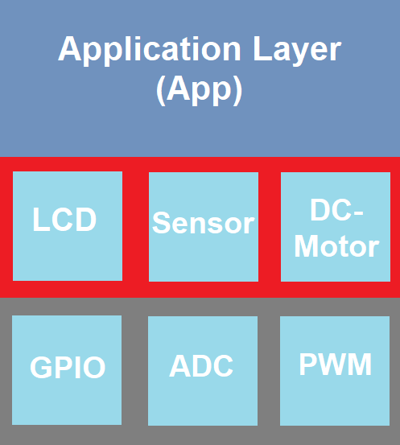
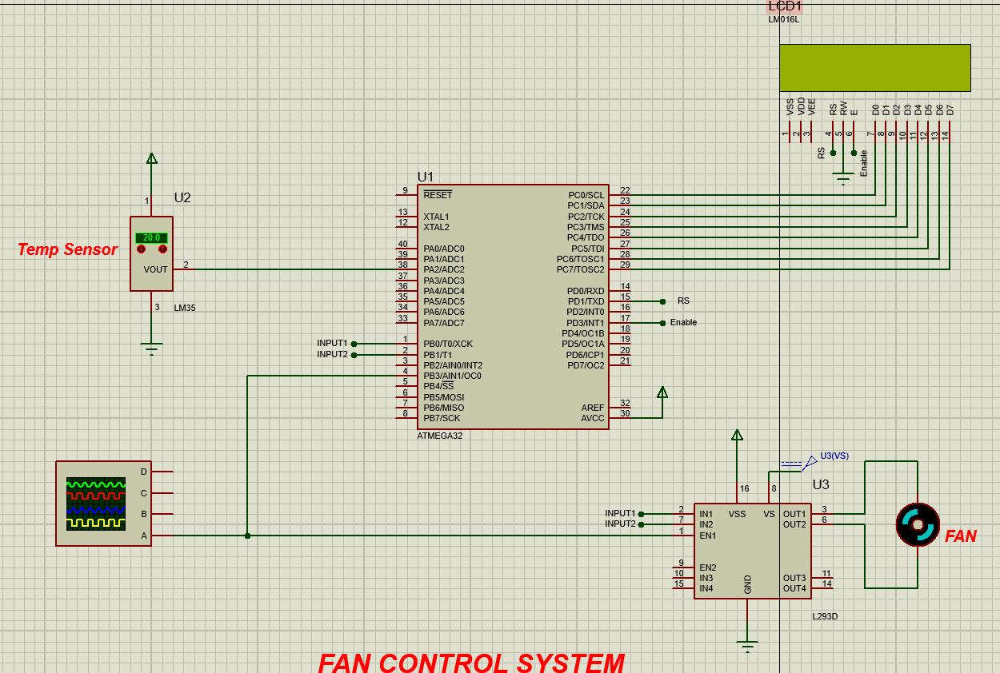

# Fan-Control_System_AVR
Implemented via **AVR atmega32** MCU with **1 MHz** internal clock frequency.
>### Project Description:

* **The fan is automatically turned OFF or ON with variable speed according to the temperature.**
* **Based on the temperature read from the  LM35 sensor, the MCU sets the fan speed as follows:**   
&emsp; <i>i. If the temperature is less than 30C, the fan is turned off.  
&emsp;    ii. If the temperature is greater than or equal 30C, the fan is turned on with 25% of its maximum speed. 
&emsp;    iii. If the temperature is greater than or equal 60C, the fan is turned on with 50% of its maximum speed.  
&emsp;    iv. If the temperature is greater than or equal 90C, the fan is turned on with 75% of its maximum speed. 
&emsp;    v. If the temperature is greater than or equal 120C, the fan is turned on with 100% of its maximum speed. </i>  
* **The fan status is continuously updated on an LCD screen.**

>### Project Design:
* **The Project follows modular design as shown in the diagram below:**

Layered Model            |  Layered Model Detailed
:-------------------------:|:-------------------------:
  |  

>### Project Simulation:

>### How to run:
* Clone the project repo via `git clone https://github.com/0marAmr/Fan-Control-System`.
* Open command prompt in the project directory.
* Run `make compile` to compile project files.
* Open ***project_simulation*** file found in ***sim*** directory.
* After simulating, run `make clean` to remove compilation files.
